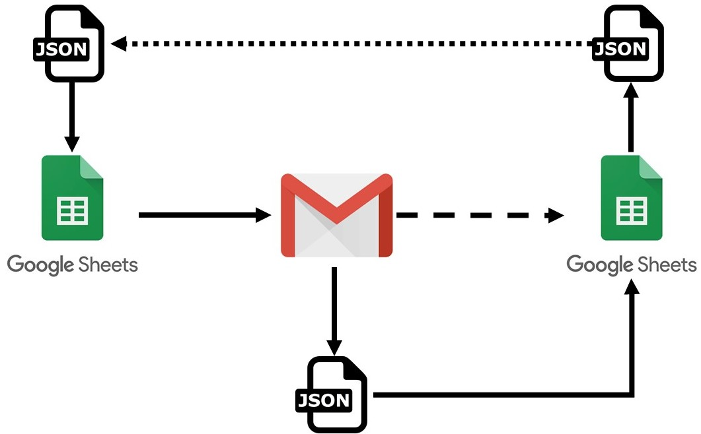
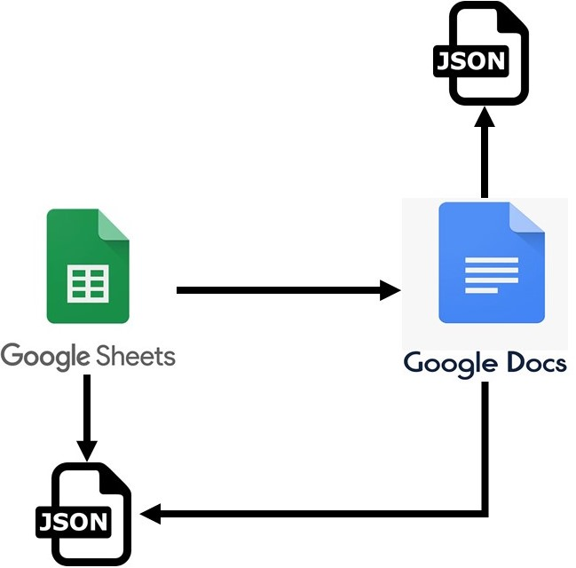

# workflow_google_suite
Integrate Google suite applications. Improve the communication of the Google Suite App: Drive, Docs, Sheets, Gmail. Using the API and Python. 
**Important links:**
* https://developers.google.com/drive/api/v3/quickstart/python
* https://developers.google.com/gmail/api/quickstart/python
* https://console.developers.google.com/apis/credentials
* https://developers.google.com/sheets/api/quickstart/python
* https://developers.google.com/docs/api/how-tos/move-text
* https://developers.google.com/docs/api/concepts/structure

Having the following processes:
* From Google sheets data send information through Gmail and expect respond, to add to Google sheets. 
 

 

* From Google Sheets data send text to feed Google Docs: Title and Text.

 

 
In addition json files are being created to control the position of the data either in sheets or docs.
